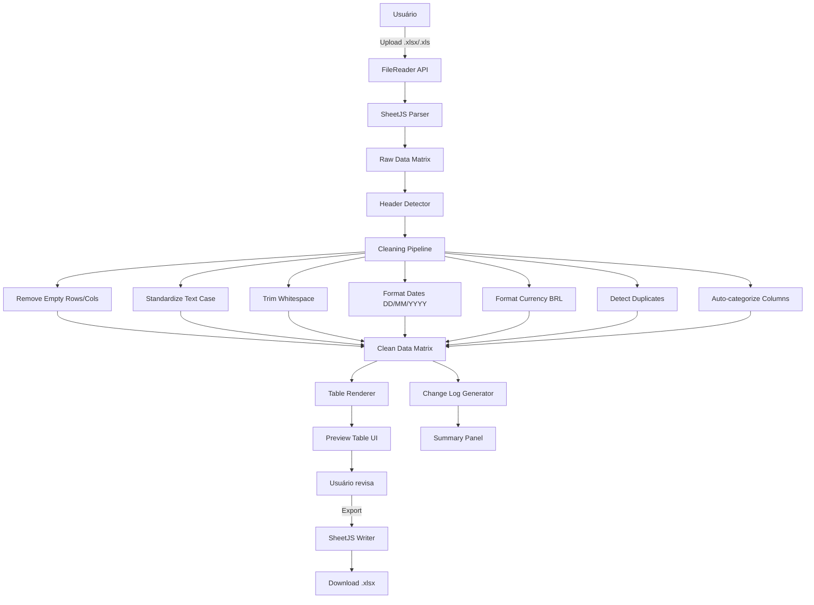
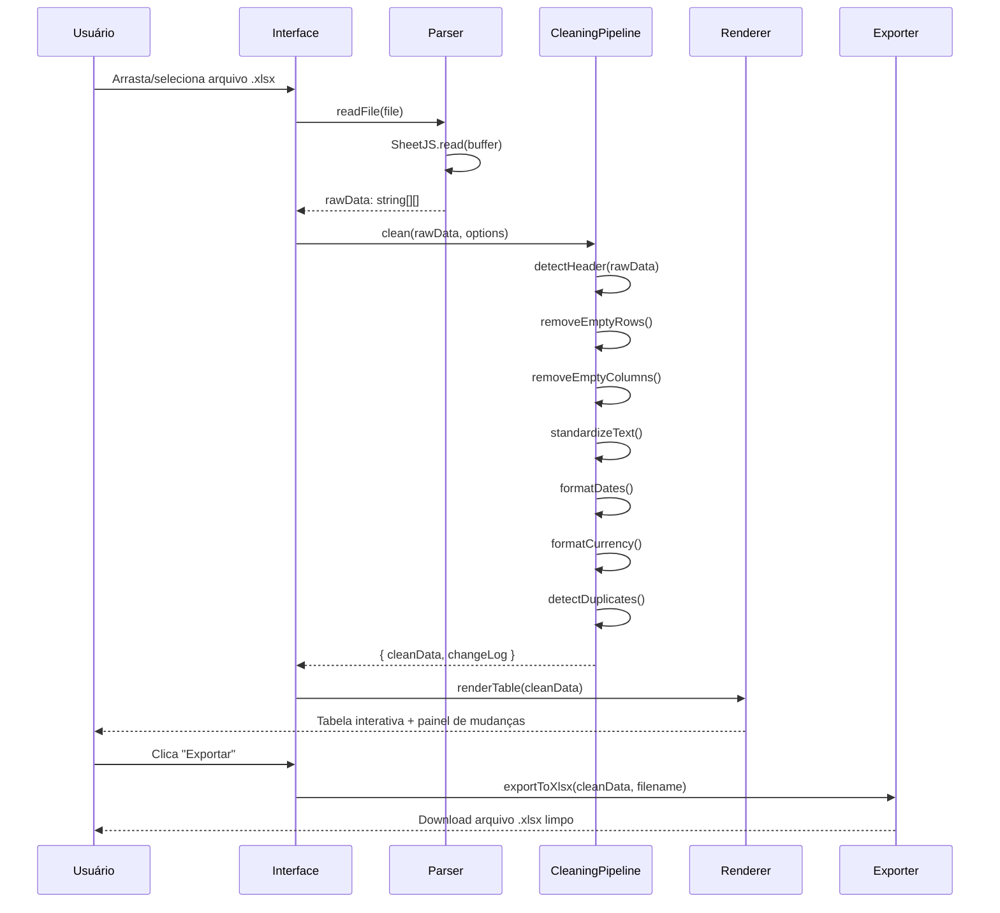

# Design Document: Excel Data Cleaner

## Visão Geral

Aplicação web frontend (HTML, CSS, JavaScript puro) que permite ao usuário carregar uma planilha Excel bruta, aplicar operações automáticas de limpeza e padronização de dados, visualizar o resultado em uma tabela interativa e exportar a planilha tratada. Toda a lógica roda no navegador, sem necessidade de backend.

A aplicação utiliza a biblioteca SheetJS (xlsx.js) para leitura e escrita de arquivos `.xlsx`/`.xls`, e implementa um pipeline de transformações configuráveis que o usuário pode ativar ou desativar antes de processar os dados.

## Arquitetura



## Diagramas de Sequência

### Fluxo Principal: Upload → Limpeza → Export



## Componentes e Interfaces

### Componente 1: FileUploader

**Propósito**: Gerencia o upload do arquivo via drag-and-drop ou seleção manual.

**Interface**:
```javascript
class FileUploader {
  /**
   * @param {HTMLElement} dropZone - Elemento da zona de drop
   * @param {Function} onFileLoaded - Callback(ArrayBuffer, filename)
   */
  constructor(dropZone, onFileLoaded) {}

  /** Registra eventos de drag-and-drop e input[type=file] */
  init() {}

  /**
   * Lê o arquivo e retorna ArrayBuffer via FileReader
   * @param {File} file
   * @returns {Promise<ArrayBuffer>}
   */
  readFile(file) {}
}
```

**Responsabilidades**:
- Validar extensão do arquivo (.xlsx, .xls, .csv)
- Ler o arquivo como ArrayBuffer
- Invocar callback com os dados brutos

---

### Componente 2: SheetParser

**Propósito**: Converte ArrayBuffer em matriz de dados usando SheetJS.

**Interface**:
```javascript
class SheetParser {
  /**
   * Parseia o buffer e retorna todas as abas disponíveis
   * @param {ArrayBuffer} buffer
   * @returns {{ sheetNames: string[], sheets: Object }}
   */
  parse(buffer) {}

  /**
   * Converte uma aba em matriz 2D de strings
   * @param {Object} workbook
   * @param {string} sheetName
   * @returns {string[][]}
   */
  sheetToMatrix(workbook, sheetName) {}
}
```

---

### Componente 3: CleaningPipeline

**Propósito**: Aplica sequencialmente as transformações de limpeza sobre a matriz de dados.

**Interface**:
```javascript
class CleaningPipeline {
  /**
   * @param {CleaningOptions} options - Opções de limpeza ativas
   */
  constructor(options) {}

  /**
   * Executa o pipeline completo
   * @param {string[][]} rawMatrix
   * @returns {{ cleanData: string[][], changeLog: ChangeEntry[] }}
   */
  run(rawMatrix) {}

  /** Detecta a linha de cabeçalho (heurística por densidade de texto) */
  detectHeader(matrix) {}

  /** Remove linhas onde todas as células são vazias */
  removeEmptyRows(matrix) {}

  /** Remove colunas onde todas as células são vazias */
  removeEmptyColumns(matrix) {}

  /** Padroniza capitalização conforme configuração (UPPER, lower, Title Case) */
  standardizeText(matrix, headerRow) {}

  /** Remove espaços extras no início, fim e múltiplos internos */
  trimWhitespace(matrix) {}

  /** Detecta e converte datas para DD/MM/AAAA */
  formatDates(matrix) {}

  /** Detecta e formata valores monetários para R$ 1.234,56 */
  formatCurrency(matrix) {}

  /** Identifica linhas duplicadas e as marca no changeLog */
  detectDuplicates(matrix) {}

  /** Sugere categorias para colunas com base em palavras-chave */
  autoDetectColumnTypes(headers) {}
}
```

---

### Componente 4: TableRenderer

**Propósito**: Renderiza a matriz limpa como tabela HTML interativa.

**Interface**:
```javascript
class TableRenderer {
  /**
   * @param {HTMLElement} container - Elemento onde a tabela será inserida
   */
  constructor(container) {}

  /**
   * Renderiza a tabela com cabeçalho destacado e linhas alternadas
   * @param {string[][]} data - Primeira linha é o cabeçalho
   * @param {ChangeEntry[]} changeLog - Para destacar células modificadas
   */
  render(data, changeLog) {}

  /** Aplica highlight visual nas células que foram alteradas */
  highlightChanges(changeLog) {}

  /** Habilita ordenação por coluna ao clicar no cabeçalho */
  enableSorting() {}
}
```

---

### Componente 5: Exporter

**Propósito**: Converte a matriz limpa de volta para .xlsx e dispara o download.

**Interface**:
```javascript
class Exporter {
  /**
   * Gera e faz download do arquivo .xlsx
   * @param {string[][]} data
   * @param {string} filename
   */
  exportToXlsx(data, filename) {}
}
```

---

### Componente 6: App (Orquestrador)

**Propósito**: Coordena todos os componentes e gerencia o estado da aplicação.

**Interface**:
```javascript
class App {
  constructor() {}
  init() {}
  handleFileLoaded(buffer, filename) {}
  handleCleaningOptionsChange(options) {}
  handleExport() {}
  handleSheetChange(sheetName) {}
}
```

## Modelos de Dados

### CleaningOptions

```javascript
/**
 * @typedef {Object} CleaningOptions
 * @property {boolean} removeEmptyRows       - Remove linhas completamente vazias
 * @property {boolean} removeEmptyColumns    - Remove colunas completamente vazias
 * @property {boolean} trimWhitespace        - Remove espaços extras
 * @property {boolean} standardizeText       - Padroniza capitalização
 * @property {'UPPER'|'lower'|'Title'} textCase - Modo de capitalização
 * @property {boolean} formatDates           - Converte datas para DD/MM/AAAA
 * @property {boolean} formatCurrency        - Formata valores monetários BRL
 * @property {boolean} detectDuplicates      - Marca linhas duplicadas
 * @property {boolean} autoDetectTypes       - Detecta tipos de coluna automaticamente
 */
```

### ChangeEntry

```javascript
/**
 * @typedef {Object} ChangeEntry
 * @property {'removed_row'|'removed_col'|'text_changed'|'date_formatted'|
 *            'currency_formatted'|'duplicate_found'|'header_detected'} type
 * @property {string} description  - Descrição legível da mudança
 * @property {number} [row]        - Índice da linha afetada (0-based)
 * @property {number} [col]        - Índice da coluna afetada (0-based)
 * @property {string} [before]     - Valor original
 * @property {string} [after]      - Valor transformado
 */
```

### AppState

```javascript
/**
 * @typedef {Object} AppState
 * @property {string|null} filename          - Nome do arquivo carregado
 * @property {string[]|null} sheetNames      - Abas disponíveis no workbook
 * @property {string|null} activeSheet       - Aba selecionada
 * @property {string[][]|null} rawData       - Dados brutos pós-parse
 * @property {string[][]|null} cleanData     - Dados após limpeza
 * @property {ChangeEntry[]} changeLog       - Log de todas as mudanças
 * @property {CleaningOptions} options       - Opções de limpeza ativas
 */
```

## Pseudocódigo Algorítmico

### Algoritmo Principal: detectHeader

```pascal
ALGORITHM detectHeader(matrix)
INPUT: matrix: string[][] (linhas × colunas)
OUTPUT: headerRowIndex: number

BEGIN
  bestScore ← 0
  bestIndex ← 0

  FOR i ← 0 TO MIN(10, matrix.length - 1) DO
    row ← matrix[i]
    nonEmptyCells ← COUNT(cell IN row WHERE cell.trim() ≠ "")
    numericCells  ← COUNT(cell IN row WHERE isNumeric(cell))
    textCells     ← nonEmptyCells - numericCells

    // Cabeçalhos tendem a ter mais texto que números
    score ← textCells * 2 - numericCells

    IF score > bestScore THEN
      bestScore ← score
      bestIndex ← i
    END IF
  END FOR

  RETURN bestIndex
END
```

**Pré-condições:**
- `matrix` tem pelo menos 1 linha
- Células são strings (podem ser vazias)

**Pós-condições:**
- Retorna índice entre 0 e MIN(9, matrix.length-1)
- O índice aponta para a linha com maior densidade de texto não-numérico

---

### Algoritmo: formatDates

```pascal
ALGORITHM formatDates(cell)
INPUT: cell: string
OUTPUT: formatted: string

CONSTANTS:
  DATE_PATTERNS ← [
    /^\d{4}-\d{2}-\d{2}$/,          // ISO: 2024-12-31
    /^\d{2}\/\d{2}\/\d{4}$/,        // BR: 31/12/2024
    /^\d{2}-\d{2}-\d{4}$/,          // 31-12-2024
    /^\d{1,2}\/\d{1,2}\/\d{2}$/     // 1/1/24
  ]

BEGIN
  FOR each pattern IN DATE_PATTERNS DO
    IF cell MATCHES pattern THEN
      date ← parseDate(cell, pattern)
      IF date IS valid THEN
        RETURN format(date, "DD/MM/AAAA")
      END IF
    END IF
  END FOR

  RETURN cell  // Sem alteração se não for data
END
```

**Pré-condições:**
- `cell` é uma string não-nula

**Pós-condições:**
- Se a célula contém uma data reconhecível, retorna no formato DD/MM/AAAA
- Caso contrário, retorna o valor original sem modificação
- Nunca lança exceção

**Invariante de loop:**
- Cada iteração testa um padrão distinto; ao encontrar match válido, retorna imediatamente

---

### Algoritmo: formatCurrency

```pascal
ALGORITHM formatCurrency(cell)
INPUT: cell: string
OUTPUT: formatted: string

BEGIN
  // Remove símbolos monetários e espaços
  cleaned ← cell.replace(/[R$\s]/g, "")

  // Normaliza separadores: detecta se usa vírgula ou ponto como decimal
  IF cleaned MATCHES /^\d{1,3}(\.\d{3})*(,\d{2})?$/ THEN
    // Formato BR: 1.234,56
    value ← parseFloat(cleaned.replace(/\./g, "").replace(",", "."))
  ELSE IF cleaned MATCHES /^\d{1,3}(,\d{3})*(\.\d{2})?$/ THEN
    // Formato US: 1,234.56
    value ← parseFloat(cleaned.replace(/,/g, ""))
  ELSE IF cleaned MATCHES /^\d+(\.\d+)?$/ THEN
    value ← parseFloat(cleaned)
  ELSE
    RETURN cell  // Não é valor monetário
  END IF

  IF value IS NaN THEN
    RETURN cell
  END IF

  RETURN "R$ " + value.toLocaleString("pt-BR", { minimumFractionDigits: 2 })
END
```

**Pré-condições:**
- `cell` é uma string não-nula

**Pós-condições:**
- Se detectado como valor monetário, retorna no formato `R$ 1.234,56`
- Caso contrário, retorna o valor original
- Nunca lança exceção

---

### Algoritmo: detectDuplicates

```pascal
ALGORITHM detectDuplicates(matrix, headerRowIndex)
INPUT: matrix: string[][], headerRowIndex: number
OUTPUT: duplicateRows: Set<number>

BEGIN
  seen ← new Map()  // chave: string normalizada da linha → índice original
  duplicateRows ← new Set()

  FOR i ← headerRowIndex + 1 TO matrix.length - 1 DO
    row ← matrix[i]
    key ← row.map(cell → cell.trim().toLowerCase()).join("|")

    IF key IN seen THEN
      duplicateRows.add(i)
    ELSE
      seen.set(key, i)
    END IF
  END FOR

  RETURN duplicateRows
END
```

**Pré-condições:**
- `headerRowIndex` < `matrix.length`

**Pós-condições:**
- Retorna conjunto de índices de linhas que são duplicatas de linhas anteriores
- A primeira ocorrência de cada linha nunca é marcada como duplicata

**Invariante de loop:**
- `seen` contém exatamente as chaves das linhas de índice `headerRowIndex+1` até `i-1`

## Exemplo de Uso

```javascript
// 1. Inicializar a aplicação
const app = new App();
app.init();

// 2. Internamente, ao carregar um arquivo:
const parser = new SheetParser();
const workbook = parser.parse(arrayBuffer);
const rawMatrix = parser.sheetToMatrix(workbook, workbook.SheetNames[0]);

// 3. Executar pipeline de limpeza
const pipeline = new CleaningPipeline({
  removeEmptyRows: true,
  removeEmptyColumns: true,
  trimWhitespace: true,
  standardizeText: true,
  textCase: 'Title',
  formatDates: true,
  formatCurrency: true,
  detectDuplicates: true,
  autoDetectTypes: false
});

const { cleanData, changeLog } = pipeline.run(rawMatrix);

// 4. Renderizar resultado
const renderer = new TableRenderer(document.getElementById('table-container'));
renderer.render(cleanData, changeLog);

// 5. Exportar
const exporter = new Exporter();
exporter.exportToXlsx(cleanData, 'dados_limpos.xlsx');
```

## Propriedades de Correção

```javascript
// P1: Nenhuma linha de dados é criada — apenas removida ou mantida
assert(cleanData.length <= rawMatrix.length);

// P2: O número de colunas é consistente em todas as linhas
const colCount = cleanData[0].length;
assert(cleanData.every(row => row.length === colCount));

// P3: Células de data formatadas sempre seguem DD/MM/AAAA
const dateRegex = /^\d{2}\/\d{2}\/\d{4}$/;
// Para toda célula marcada como 'date_formatted' no changeLog:
changeLog
  .filter(e => e.type === 'date_formatted')
  .forEach(e => assert(dateRegex.test(cleanData[e.row][e.col])));

// P4: Células monetárias formatadas sempre começam com "R$ "
changeLog
  .filter(e => e.type === 'currency_formatted')
  .forEach(e => assert(cleanData[e.row][e.col].startsWith('R$ ')));

// P5: Nenhum dado original é inventado — apenas transformado
// (verificado pelo changeLog: todo 'after' deriva de um 'before' não-vazio)
changeLog
  .filter(e => e.before !== undefined)
  .forEach(e => assert(e.before.trim() !== '' || e.after === ''));
```

## Tratamento de Erros

### Cenário 1: Arquivo inválido ou corrompido

**Condição**: SheetJS lança exceção ao tentar parsear o buffer  
**Resposta**: Captura o erro, exibe mensagem amigável na UI ("Arquivo inválido ou corrompido. Tente outro arquivo.")  
**Recuperação**: Mantém estado anterior; usuário pode tentar novo upload

### Cenário 2: Planilha vazia ou sem dados reconhecíveis

**Condição**: Matriz resultante tem 0 linhas ou apenas linhas vazias  
**Resposta**: Exibe aviso ("Nenhum dado encontrado na aba selecionada.")  
**Recuperação**: Usuário pode selecionar outra aba do workbook

### Cenário 3: Arquivo muito grande (>10MB)

**Condição**: `file.size > 10 * 1024 * 1024`  
**Resposta**: Aviso antes do processamento ("Arquivo grande — o processamento pode demorar alguns segundos.")  
**Recuperação**: Processamento continua normalmente; sem bloqueio

### Cenário 4: Formato de data ambíguo

**Condição**: Data como `01/02/03` pode ser interpretada de múltiplas formas  
**Resposta**: Não formata; mantém valor original; registra no changeLog como `'ambiguous_date'`  
**Recuperação**: Usuário visualiza o aviso no painel de mudanças

## Estratégia de Testes

### Testes Unitários

Cada função do `CleaningPipeline` deve ser testada isoladamente:

- `detectHeader`: matrizes com cabeçalho na linha 0, 1, 2; matrizes sem cabeçalho claro
- `removeEmptyRows`: linhas totalmente vazias, linhas parcialmente vazias, sem linhas vazias
- `formatDates`: todos os padrões suportados, datas inválidas, strings não-data
- `formatCurrency`: formato BR, formato US, valores sem centavos, strings não-monetárias
- `detectDuplicates`: sem duplicatas, com duplicatas consecutivas, com duplicatas distantes

### Testes Baseados em Propriedades

**Biblioteca**: fast-check

```javascript
// Propriedade: pipeline nunca aumenta o número de linhas
fc.assert(fc.property(
  fc.array(fc.array(fc.string(), { minLength: 1, maxLength: 20 }), { minLength: 1, maxLength: 100 }),
  (matrix) => {
    const { cleanData } = pipeline.run(matrix);
    return cleanData.length <= matrix.length;
  }
));

// Propriedade: trimWhitespace é idempotente
fc.assert(fc.property(
  fc.array(fc.array(fc.string())),
  (matrix) => {
    const once = pipeline.trimWhitespace(matrix);
    const twice = pipeline.trimWhitespace(once);
    return JSON.stringify(once) === JSON.stringify(twice);
  }
));
```

### Testes de Integração

- Upload de arquivo `.xlsx` real → verificar que a tabela renderiza corretamente
- Pipeline completo com planilha de exemplo contendo todos os tipos de sujeira
- Export → re-import do arquivo gerado → verificar que os dados são idênticos

## Considerações de Performance

- Arquivos grandes (>5000 linhas): processar em chunks usando `setTimeout` ou `requestIdleCallback` para não bloquear a UI
- Renderização da tabela: usar virtualização (renderizar apenas as linhas visíveis) para datasets >1000 linhas
- SheetJS deve ser carregado via CDN com `defer` para não bloquear o carregamento inicial da página

## Considerações de Segurança

- Todo processamento ocorre no navegador — nenhum dado é enviado para servidores
- Validar extensão e tipo MIME do arquivo antes de processar
- Limitar tamanho máximo do arquivo para evitar travamento do navegador (sugestão: 50MB)
- Sanitizar conteúdo das células antes de inserir no DOM (usar `textContent` em vez de `innerHTML`)

## Dependências

| Dependência | Versão | Uso |
|-------------|--------|-----|
| SheetJS (xlsx) | ^0.18 | Leitura e escrita de arquivos .xlsx/.xls |
| fast-check | ^3.x | Testes baseados em propriedades (dev only) |

Sem frameworks CSS ou JS — interface construída com HTML/CSS/JS puro.
